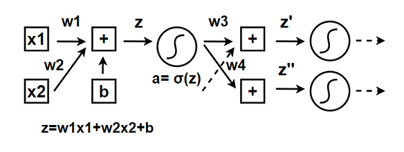

# Lecture 1 Introduction of Deep Learning Extra

Full course Syllabus reference to [Machine Learing 2022 Spring](https://speech.ee.ntu.edu.tw/~hylee/ml/2022-spring.php?fbclid=IwAR2rE3UFymIOeTEoEzyZBhO-5vbpYpyw1Ho_KHO8cmwVd0_f7nI3iYunW4A)  
Note for lecture(Hung-yi Lee YouTube)  
(1) [ML Lecture 6: Brief Introduction of Deep Learning](https://www.youtube.com/watch?v=Dr-WRlEFefw)  
(2) [ML Lecture 7: Backpropagation](https://www.youtube.com/watch?v=ibJpTrp5mcE)  
(3)  [ML Lecture 1: Regression - Case Study](https://www.youtube.com/watch?v=fegAeph9UaA)  
(4) [ML Lecture 4: Classification](https://www.youtube.com/watch?v=fZAZUYEeIMg)  
(5) [ML Lecture 5: Logistic Regression](https://www.youtube.com/watch?v=hSXFuypLukA)  

## Deep Learning

(1) Define a set of function  
(2) Goodness of function  
(3) Pick the best function  

### Fully Connected Feedforward

Layer 1: input layer  
Layer 2: hidden layer  
...  
Layer N-1: hidden layer (feature extractor replacing feature engineering)  
Layer N: output layer  

  

Write the calculation as a matrix:  
$$
\sigma \left(
\begin{bmatrix}
1 & -2 \\
-1 & 1
\end{bmatrix}
\begin{bmatrix}
1 \\
-1
\end{bmatrix}
+
\begin{bmatrix}
1 \\
0
\end{bmatrix}
\right)
=
\begin{bmatrix}
0.98 \\
0.12
\end{bmatrix}
$$

Example: Handwriting Digit Recognition  
Input 16*16: 256 dim, output 0~9: 10 dim  

### Cross Entropy

$$
C \Rightarrow \mathcal{L} = \sum C^n \quad \text{gradient descent}
$$

#### Universal Approximation Theorem
Any continuous f

$$
f: \mathcal{R}^N \rightarrow \mathcal{R}^M
$$

can by realized by a network with one hidden layer(with enough hidden neurons)  

## Backpropagation

$$
\mathcal{L}(\theta) = \sum_{n=1}^{N} C^n(\theta)
$$

$$
\frac{\partial}{\partial w} \mathcal{L}(\theta) = \sum_{n=1}^{N} \frac{\partial C^n(\theta)}{\partial w}
$$

