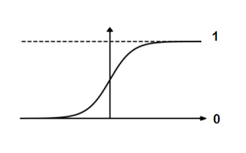
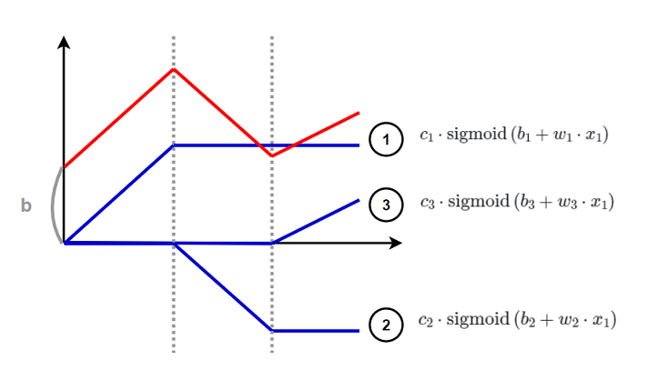

# Lecture 1:Introduction of Deep Learning

## Sigmoid Function

  

The sigmoid function is:  

$$
S(t) = \frac{1}{1 + e^{-t}}
$$

The equation for the output \( y \) is:

$$
y = c\cdot\frac{1}{1 + e^{-(b+w \cdot x_1)}}
= c\cdot \text{sigmoid}(b+w \cdot x_1)
$$

where:
- \( w \): slopes
- \( b \): shift
- \( c \): height
- \( x \): feature

## Hard Sigmoid

### Combining Hard Sigmoid

The formula for the combining hard sigmoid is:

$$
y = b + \sum_{i} c_i \cdot \text{sigmoid}\left(b_i + w_i \cdot x_1\right)
$$

where \(x_1\) varies.

For different \(x_j\), we have:

$$
r = b + \sum_{j} \left(w_j \cdot x_j\right), \quad a = \text{sigmoid}(r) = \frac{1}{1 + e^{-r}}
$$

Therefore,

$$
y = b + \sum_{i} c_i \cdot \text{sigmoid}\left(b_i + \sum_{j} \left(w_{ij} \cdot x_j\right)\right)
$$
